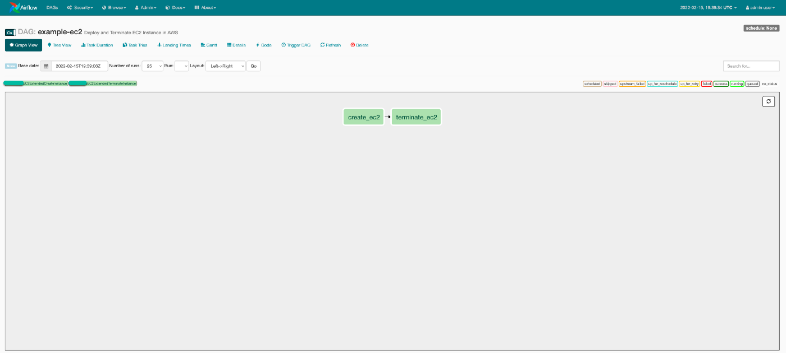
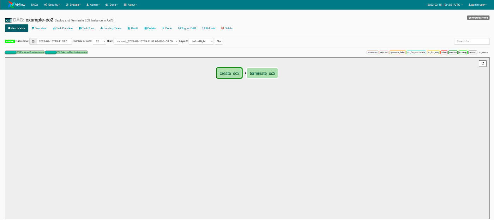
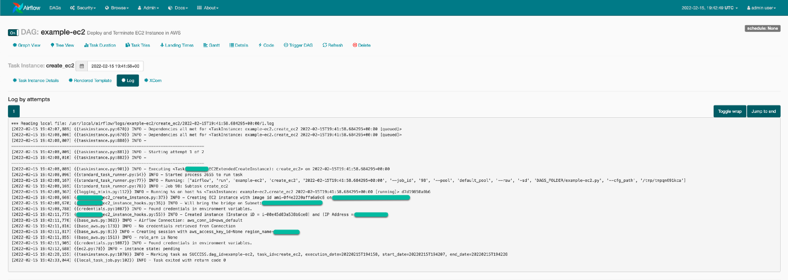
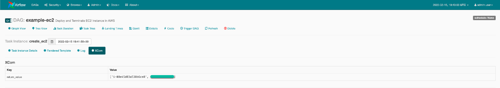
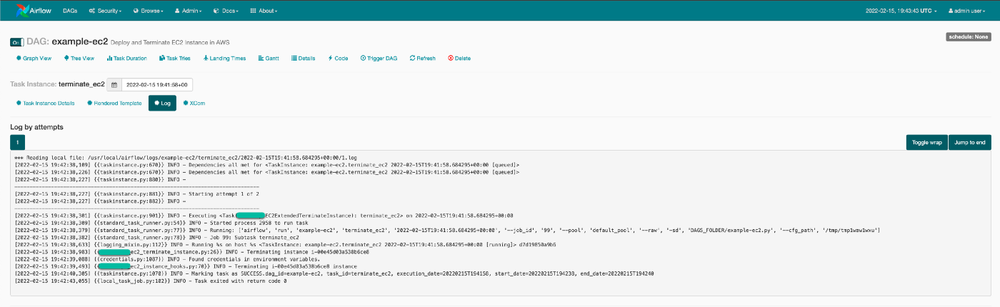

## Airflow Plugin - EC2 Extended

----
This plugin provides the functionality to `creates` and `terminate` an `ec2` instance.

### Hooks
[EC2ExtendedHooks](./hooks/ec2_instance_hooks.py) class provides a ec2 hook, which further provides 2 methods [create_instance](./hooks/ec2_instance_hooks.py#) 
and [terminate_instance](./hooks/ec2_instance_hooks.py)

### Operators
[EC2ExtendedCreateInstance](./operators/ec2_create_instance.py) class `creates` the `ec2` instances
[EC2ExtendedTerminateInstance](./operators/ec2_terminate_instance.py) class `terminates` the `ec2` instances

### Airflow Screenshots

- `dag` tree view



- `dag` execution `creation` of `ec2`



- `dag` execution logs



- `dag` execution `termination` of `ec2`



- `dag` execution logs



### Usages 
Here is an example `dag`, using **EC2ExtendedPlugin**, in combination of [SSHOperator](https://airflow.apache.org/docs/apache-airflow/1.10.13/_api/airflow/contrib/operators/ssh_operator/index.html) 
and [PythonOperator](https://airflow.apache.org/docs/apache-airflow/1.10.12/howto/operator/python.html)

```python
import base64
import logging
import os
from airflow import DAG
from datetime import timedelta, datetime
from airflow.contrib.hooks.aws_hook import AwsHook
from airflow.contrib.hooks.ssh_hook import SSHHook
from airflow.contrib.operators.ssh_operator import SSHOperator
from airflow.models import Variable
from airflow.operators.python_operator import PythonOperator
from airflow.utils.dates import days_ago
from operators.ec2_create_instance import EC2ExtendedCreateInstance
from operators.ec2_terminate_instance import EC2ExtendedTerminateInstance

DEFAULT_ARGS = {
    'owner': 'airflow',
    'depends_on_past': False,
    'email': ['kodelint@gmail.com'],
    'email_on_failure': False,
    'email_on_retry': False,
    'start_date': datetime.now() - timedelta(minutes=20),
    'retries': 1,
    'retry_delay': timedelta(minutes=5),
    'provide_context': True,
}


def string2list(**kwargs) -> list:
    sgs = list(Variable.get("bridge_sgs").split(','))
    logging.info(sgs)
    return sgs


DAG_ID = os.path.basename(__file__).replace(".py", "")
bridge_security_group_ids = string2list()
bridge_subnet = Variable.get("bridge_subnet")
bridge_image_id = Variable.get("bridge_image_id")


def read_from_aws_sm(**kwargs):
    hook = AwsHook()
    client = hook.get_client_type('secretsmanager', region_name='us-east-1')
    response = client.get_secret_value(SecretId='pipeline_secret_key01')
    myConnSecretString = response["SecretString"]
    decoded = base64.b64decode(myConnSecretString)
    with open('/tmp/pipeline_secret_key01.pem', 'w', encoding="utf-8") as output_file:
        output_file.write(decoded.decode("utf-8"))


with DAG(
        dag_id=DAG_ID,
        description="Deploy and Terminate EC2 Instance in AWS",
        default_args=DEFAULT_ARGS,
        dagrun_timeout=timedelta(hours=2),
        start_date=days_ago(1),
        schedule_interval=None,
        tags=["RemoteExecution", "ec2", "CustomOperators", "python_callable"],
) as dag:
    print_some_stuff = PythonOperator(
        task_id='print_some_stuff',
        python_callable=string2list,
    )

    create_ec2 = EC2ExtendedCreateInstance(
        subnet_id=bridge_subnet,
        security_group_ids=bridge_security_group_ids,
        image_id=bridge_image_id,
        instance_type='t2.medium',
        key_name='pipeline_secret_key01',
        tags=[{"Key": "name", "Value": "AutoDeployed via Airflow Pipeline"}],
        aws_conn_id='aws_default',
        region_name='us-east-1',
        task_id='create_ec2',
    )

    generate_ssh_key = PythonOperator(
        task_id='generate_ssh_key',
        python_callable=read_from_aws_sm,
    )

    execute_command = SSHOperator(
        task_id='execute_command',
        ssh_hook=SSHHook(
            ssh_conn_id='ssh_default',
            remote_host="{{ task_instance.xcom_pull('create_ec2', dag_id=DAG_ID, key='return_value')[1] }}",
            key_file='/tmp/pipeline_secret_key01.pem',
            username='ec2-user',
        ),
        remote_host="{{ task_instance.xcom_pull('create_ec2', dag_id=DAG_ID, key='return_value')[1] }}",
        command='uptime; df -h; hostname',
    )

    terminate_ec2 = EC2ExtendedTerminateInstance(
        instance_id="{{ task_instance.xcom_pull('create_ec2', dag_id=DAG_ID, key='return_value')[0] }}",
        region_name='us-east-1',
        task_id='terminate_ec2',
    )

print_some_stuff >> create_ec2 >> generate_ssh_key >> execute_command >> terminate_ec2
```